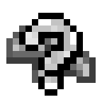

# 💰 Caches

### Obtaining Caches

Gem Bags can be obtained from various sources such as the Vote Crate, Daily Contracts, Events, and Dex Rewards.

### Contents

When opening a Cache, you will be presented with a few randomized options of items to choose from based on the type or tier of the Cache. Just pick the one you want most out of the available options to claim it!

### Types of Caches

Currently available types of Caches include:

<table><thead><tr><th width="118"></th><th></th></tr></thead><tbody><tr><td></td><td>Random Choice <a href="https://pixelmonmod.com/wiki/Gems">Gem</a> Cache</td></tr><tr><td></td><td>Random Choice <a href="https://pixelmonmod.com/wiki/Mega_Stone">Megastone</a> Cache</td></tr><tr><td></td><td>Random Choice <a href="https://pixelmonmod.com/wiki/Z-Crystals">Z-Item</a> Cache</td></tr><tr><td></td><td>Random Choice <a href="https://pixelmonmod.com/wiki/Mints">Mint</a> Cache</td></tr><tr><td></td><td>Random Choice <a href="../pixelmon/move-tutor-terminal.md">Essence </a>Cache</td></tr></tbody></table>

