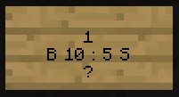

# 🏪 Chest Shops

To create a Chest Shop:

1. Place a sign on a chest (hold shift/sneak to place the sign without opening the chest.
2. Leave the first line blank.
3. On the second line, enter the quantity/amount you would like to buy/sell at a time
4. On the third line you will enter how much money you want to buy and/or sell an item for.\
   To Buy an item for $10 for example you will type `B 10`. To Sell an item for $5 you would type `S 5`. To both buy and sell items from the same Chest Shop, add a `:` between the two, as shown in the example below.\
   \
   **Note**: Buy and Sell are from the Chest's perspective. So Sell means the Shop will Sell the item to the player for the specified amount, and Buy means you will buy the item from other players.
5. On the last line of the sign, type a `?`. Press Done.
6. For the final step, **right click on the sign with the item** you want to sell. This will replace the `?` with the item ID of the item on the sign, and your shop will begin accepting transactions!\
   \
   When a player right clicks a shop, they will buy an item from your shop. When a player left clicks a shop, they will sell an item to your shop.

## Example:&#x20;

This example will show you how to sell a single Revive for $5 and buy them for $10 each

After right clicking on the sign above with a Revive in my hand, the chest shop will change appearance to show that it is working:

.png>)
