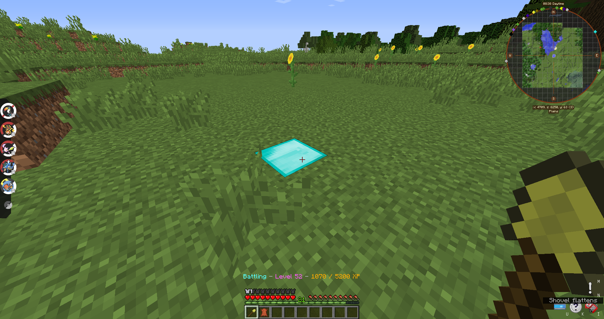
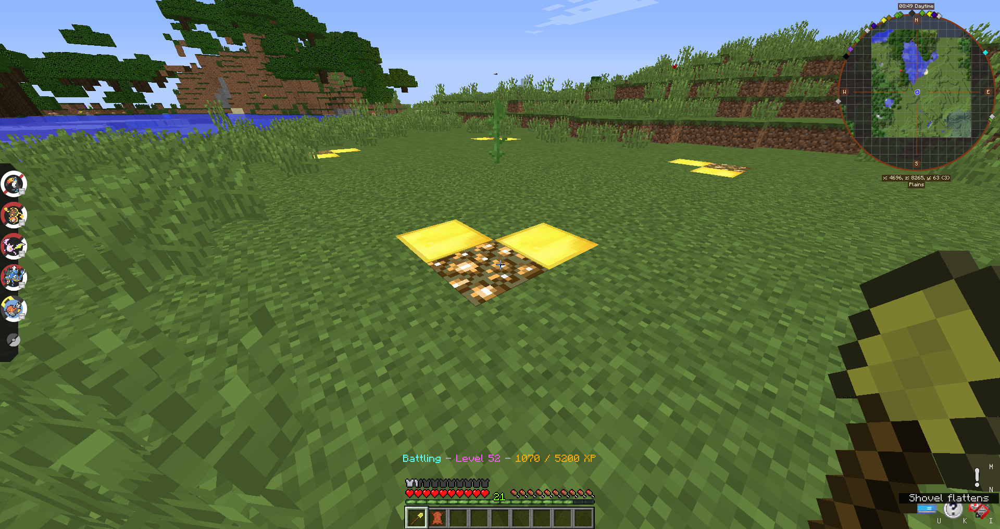

# 🔐 Claiming 101: The Basics

> A Guide written by **DartPokeMM**

So you want to know how to claim your stuff and protect it from those pesky griefers? Don't worry, GriefDefender will stop them dead in their tracks! How do you get started? Well, find where/what you want to protect!

## Creating a Claim

1. Take a **Golden Shovel** - You should get one automatically when you join, but if you lost it you can craft one or get one from another player. Then, we **right-click the ground** with it. This will set the first corner of your claim. The Diamond Block will indicate such:

<figure><figcaption></figcaption></figure>

2. Now, move to the farthest corner of what you want to claim. When you get there, **right-click the ground again**, and an outline of what you claimed will now show up in gold with glowstone corners:

<figure><figcaption></figcaption></figure>

Your area is now protected! But what if you want to expand your claim, or want to see what other people have claimedd? That's easy too!

## Inspecting Claims

To inspect a claim, use a stick (any stick will do!) and right-click a block. If nothing shows up, it's not claimed. However, if the gold and glowstone border pops up, it's claimed!&#x20;

## Expanding a Claim

If you want to expand your claim, first inspect it using a stick to make the borders visible, then right-click on a corner and move it to any other spot. Easy as that!

## Deleting/Removing a Claim

And if you want to get rid of your claim, the easiest way is to stand inside the borders of your claim and type `/abandonclaim`. Then, you will get a prompt to confirm - so click the green confirm button, and ta-da! You got your claim blocks back.

If you have any further questions - or worse yet, problems - contact staff! We're always ready and willing to help! Feel comfortable and ready for the next steps? Check out the next guide: [Claiming 102: Towns and Subclaims!](claiming-102-towns-and-subclaims.md)
