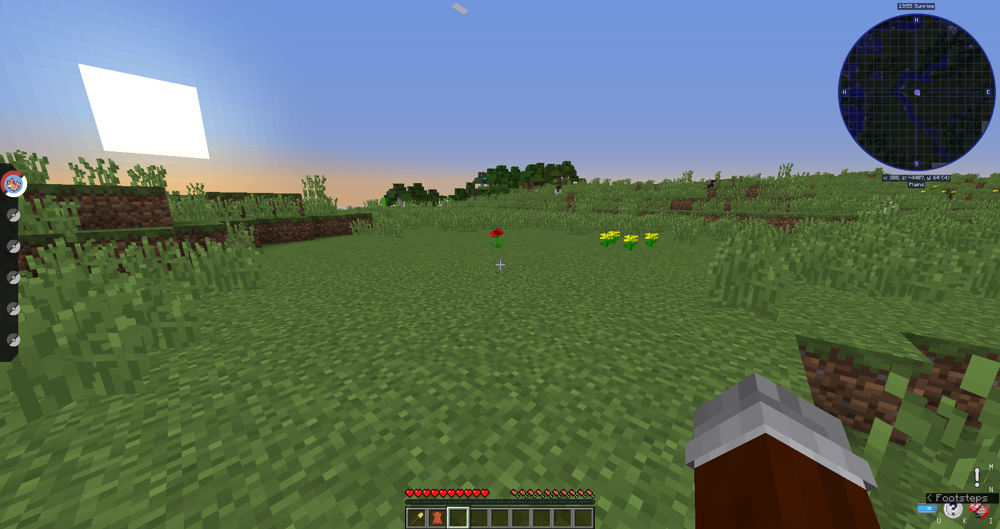
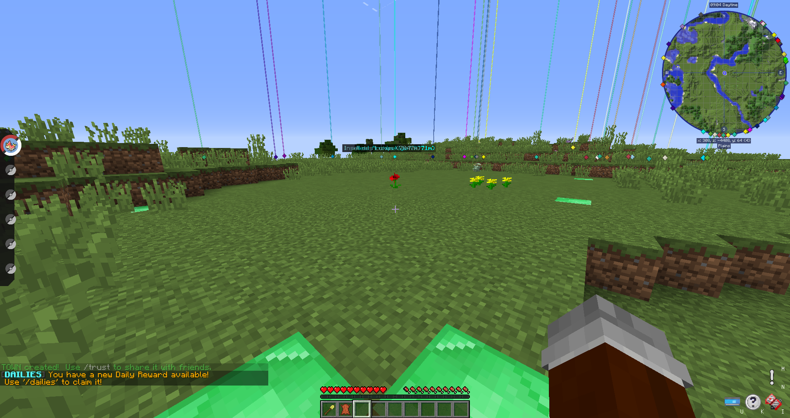
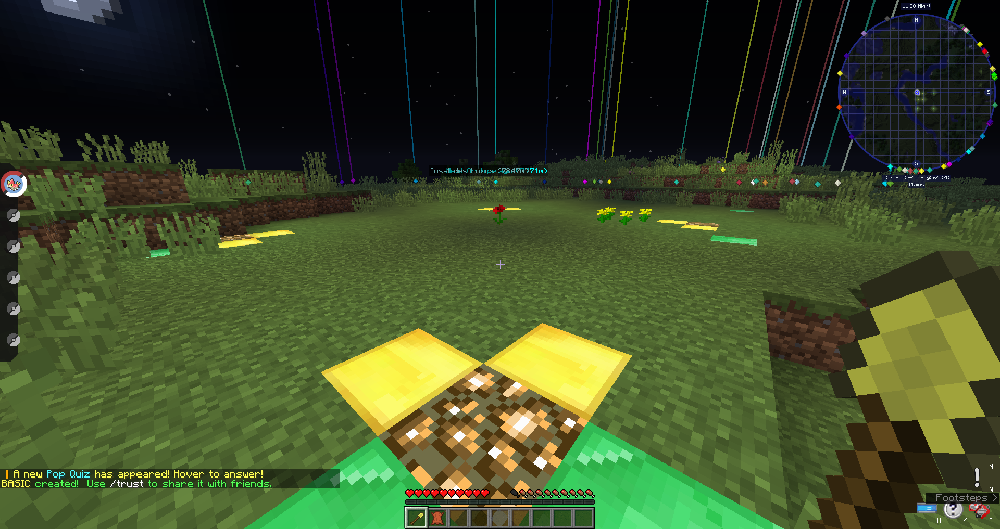
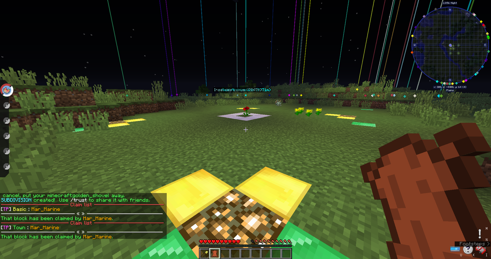
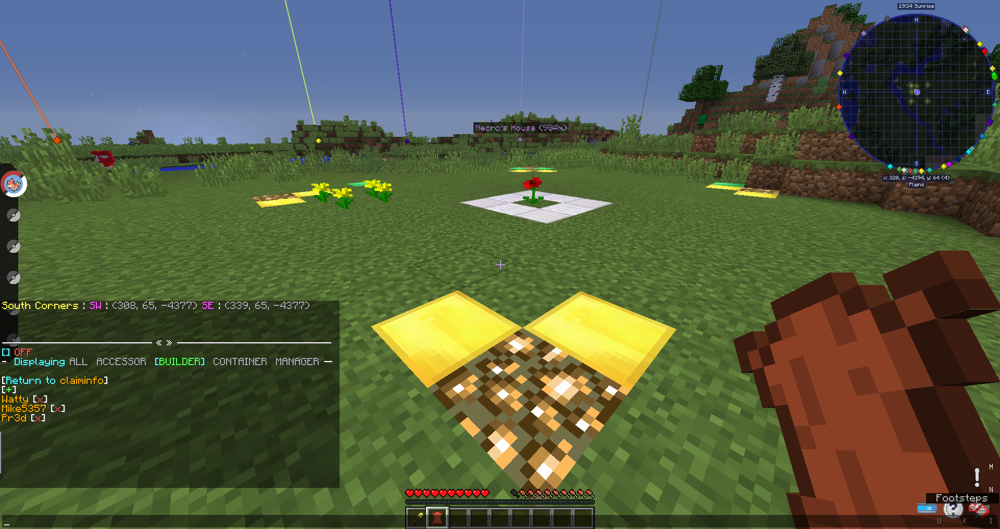
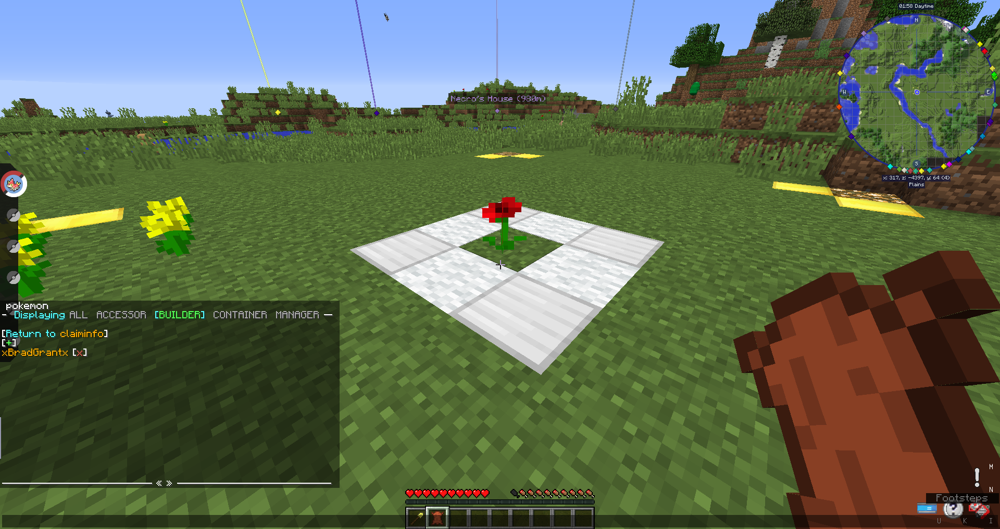
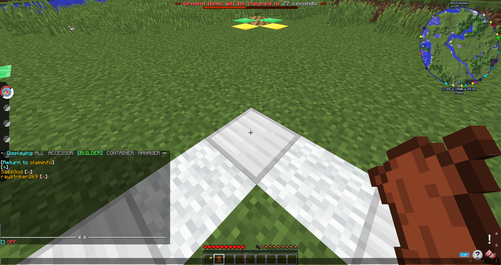
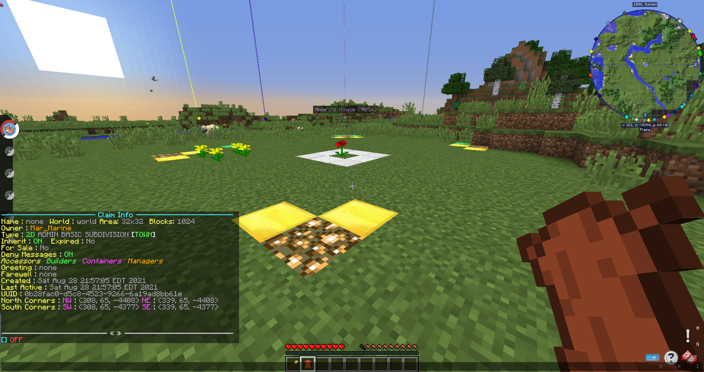
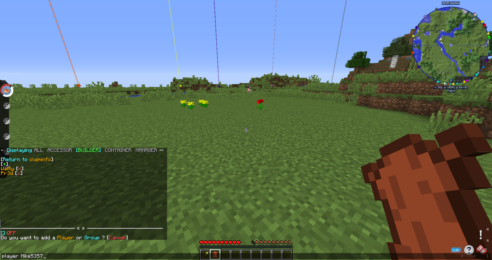

# 🔏 Claiming 102: Towns and Subclaims

> A Guide written by **DartPokeMM**

Survived [Claiming 101](claiming-101-the-basics.md)? Congratulations! Now, we will discuss Town Claims and Subdivisions - claims within claims. Things can be a bit complicated, so don't be afraid if you have to wipe the claim and start over - sometimes, it's necessary or just plain easier to start from scratch. This will be a lengthy guide, as it covers a more in-depth part of the claiming system, and as such it will be split into two sections, so strap in!

## Section 1: Claims, 102

Today, we will protect this lonely Poppy.

<figure><figcaption></figcaption></figure>

However, we're not going to just protect it, we're going to move in a family of dandelions! We'll create a Town claim, so that we can split up permissions. between the layers. A Town claim can hold Basic and Subdivided claims, and a Basic claim can hold even more Subdivided claims. First, we will want to use `/townclaims` or `/modetown` while holding our shovel to change the mode our shovel claims in. Then we just claim like normal, although we also have to spend an initial town creation fee of $5,000, and the claim must be at least 32x32 blocks. Once claimed, your Town claim should show up with an Emerald Block boundary, like this:

<figure><figcaption></figcaption></figure>

* Note: You can only ever create 1 Town claim, and you cannot convert an existing Basic or Subdivided claim into a Town claim.

Now, we can leave the Town claiming mode with `/basicclaims` or `/modebasic`, which will put us in the normal claiming mode. I will claim all the flowers, so that they have their own space within the Town. Permissions for players can be edited separate from the Town claim, so a player can be trusted inside a Basic claim, and not in the Town Claim. This lets you have buildings that have their own claims within their town claims, among other creative uses such as "public use" buildings, like a PokeCenter!

<figure><figcaption></figcaption></figure>

Now, I will subdivide the Poppy so that it has its own protected block, with its own, unique permissions. First we ender subdivision mode with `/subdivideclaims` or `/modesubdivide`. It will have a border of Iron blocks and wool, to help you differentiate between the other kinds of claims.&#x20;

<figure><figcaption></figcaption></figure>

Now, we can trust people in the Town, like I have done here; I trusted all the Owners to build and destroy within my claim (If you want to see this menu, I will describe it towards the end!).

<figure><figcaption></figcaption></figure>

However, if we step inside the Basic claim, we can see that only the Manager is permitted to build and destroy within the claim!

<figure><figcaption></figcaption></figure>

And if you didn't see the pattern, if we share the block with the Poppy in its Subdivided claim to see who has permission to build and destroy, we can see it is the two current Admins!&#x20;

<figure><figcaption></figcaption></figure>

## Section 2: Advanced Claim Management

So you're looking to modify how people interact with your claims on a deeper level? No problem! GriefDefender makes it a bit easier through the use of this command and it's chat interface; `/claiminfo` (while standing inside your claim). As we can see in this screenshot, it brings up a menu in chat describing the claim we're standing in:

<figure><figcaption></figcaption></figure>

(Enlarged to show chat menu better) You can use your mouse to click on the menu. For example, we can click any of the permission groups (Accessors, Builders, Containers, Managers, which we will discuss soon) and it will change out UI in chat to show who is in that group.

Like shown before, the Owners are all trusted as Builders in the Town claim. If we click the X to any of their names, they will be removed from the Builders permissions group. `/trust` will default to adding people to the Builders group. To manually trust people to other groups, you can either click the group name in `/claiminfo` and click the + that shows up towards the top, which will prompt us with this;&#x20;

<figure><figcaption></figcaption></figure>

For our purposes, we will only worry about clicking Player, as I haven't found a practical and/or safe use for Group. It will prompt us with "player " in chat. Clear out the "" and instead type a username - exactly as it appears, case sensitive - then hit enter. Now that person should show up in the claim's list for that permission group!

<figure><figcaption></figcaption></figure>

(In this image, I removed Mike's name from the Builders list, and am about to add him back) What's important is that each claim has it's own, unique set of permissions that you must grant to people. Furthermore, if you trust someone in a Town claim, they can do things in a Subdivided claim that's within the Town claim.

\
If you have any further questions - or worse yet, problems - contact staff! We're always ready and willing to help! Feel comfortable and ready for the next steps? Check out the next guide: [Claiming 102: Towns and Subclaims!](claiming-102-towns-and-subclaims.md)
